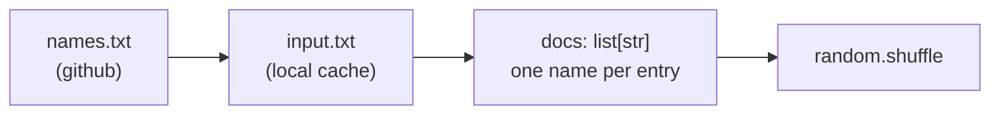
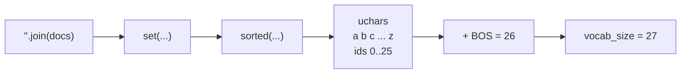
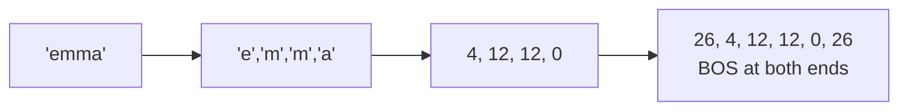

---
jupytext:
  text_representation:
    extension: .md
    format_name: myst
    format_version: 0.13
kernelspec:
  display_name: LightningcatcherGPT
  language: python
  name: lcgpt
---

# 01 — Plumbing & tokenization

Covers `karpathy_gpt.py` lines 1–26, the line that sets `block_size`, and the two
lines where the tokenizer is actually put to work (156 and 198).

Code cells reproduce the source verbatim, dedented where a fragment sits inside a
function or a loop. Anything that is *not* from the source is marked as such.

+++

## 1.1 Preamble — lines 1–11

The docstring states the thesis. Three standard-library imports and nothing else:
`os` for the file-existence check, `math` for `log` and `exp`, `random` for
weight initialisation, shuffling and sampling. The seed is fixed, so every run
produces identical numbers.

```{code-cell} ipython3
"""
The most atomic way to train and run inference for a GPT in pure, dependency-free Python.
This file is the complete algorithm.
Everything else is just efficiency.
@karpathy
"""

import os       # os.path.exists
import math     # math.log, math.exp
import random   # random.seed, random.choices, random.gauss, random.shuffle
random.seed(42) # Let there be order among chaos
```

## 1.2 The dataset — lines 13–20

Downloads `names.txt` on first run and caches it as `input.txt`. Each non-empty
line becomes one document. The shuffle matters: training walks `docs` in order,
one document per step, so an unshuffled file would feed the model alphabetically
sorted names.



```{code-cell} ipython3
# Let there be a Dataset `docs`: list[str] of documents (e.g. a list of names)
if not os.path.exists('input.txt'):
    import urllib.request
    names_url = 'https://raw.githubusercontent.com/karpathy/makemore/988aa59/names.txt'
    urllib.request.urlretrieve(names_url, 'input.txt')
docs = [line.strip() for line in open('input.txt') if line.strip()]
random.shuffle(docs)
print(f"num docs: {len(docs)}")
```

## 1.3 The tokenizer — lines 22–26

The vocabulary is every distinct character in the corpus, sorted. A character's
token id is simply its index in `uchars`, which makes encoding a lookup and
decoding an index. One extra id is appended for **BOS**, which marks both the
start and the end of a document.

$$
\texttt{BOS} = |\mathcal{U}|, \qquad
\texttt{vocab\_size} = |\mathcal{U}| + 1
$$

For `names.txt` the alphabet is the 26 lowercase letters, so `BOS = 26` and
`vocab_size = 27`.



```{code-cell} ipython3
# Let there be a Tokenizer to translate strings to sequences of integers ("tokens") and back
uchars = sorted(set(''.join(docs))) # unique characters in the dataset become token ids 0..n-1
BOS = len(uchars) # token id for a special Beginning of Sequence (BOS) token
vocab_size = len(uchars) + 1 # total number of unique tokens, +1 is for BOS
print(f"vocab size: {vocab_size}")
```

## 1.4 Why `block_size = 16` — line 76

`block_size` is the maximum number of positions the model can attend over. A name
of length $L$ becomes $L + 2$ tokens once BOS is added at both ends, and the
training loop uses one fewer than that, because the last token is only ever a
target:

$$
n = \min(\texttt{block\_size},\; |\text{tokens}| - 1)
$$

The longest name in the corpus is 15 characters, giving 17 tokens and $n = 16$.
So `block_size = 16` is exactly enough to hold the longest document with nothing
to spare. Real systems size this independently of the data and truncate.

```{code-cell} ipython3
block_size = 16 # maximum context length of the attention window (note: the longest name is 15 characters)

# Not from the source: the dataset statistics that motivate the number above.
from collections import Counter

lengths = [len(d) for d in docs]
print(f"names:   {len(docs)}")
print(f"longest: {max(lengths)} chars -> {max(lengths) + 2} tokens with BOS at both ends")
print(f"mean:    {sum(lengths) / len(lengths):.2f} chars")
print()
for L, count in sorted(Counter(lengths).items()):
    print(f"{L:3d} | {'#' * (count // 100)} {count}")
```

## 1.5 Encode, in action — line 156

The whole encoder is one line, buried in the training loop. `uchars.index(ch)`
is a linear scan — fine at vocabulary size 27, and the kind of thing a real
tokenizer replaces with a dict.

> Also appears as §5.2 in notebook 05, where it runs in its proper context
> inside the training loop.



```{code-cell} ipython3
doc = "emma"                                               # not from the source

tokens = [BOS] + [uchars.index(ch) for ch in doc] + [BOS]  # line 156, verbatim

print(doc, "->", tokens)                                   # not from the source
```

## 1.6 Decode, in action — line 198

Decoding is the inverse index. Note what the sampling loop does *not* decode:
BOS has no character, so it breaks out of the loop rather than appending
anything.

> Also appears as §5.10 in notebook 05, inside the sampling loop.

```{code-cell} ipython3
sample = []                                                # not from the source
for token_id in tokens:                                    # not from the source
    if token_id == BOS:                                    # not from the source
        continue                                           # not from the source

    sample.append(uchars[token_id])                        # line 198, verbatim

print(''.join(sample))                                     # not from the source
```

## 1.7 A Shannon n-gram baseline

Not from the source at all. Now that the corpus is tokenized we already have
everything needed to generate names by counting, with no neural network
anywhere. Count how often each token follows each context of length $n-1$, then
sample from those counts:

$$
P(t_i \mid t_{i-n+1}, \ldots, t_{i-1}) \;=\;
\frac{C(t_{i-n+1}, \ldots, t_{i-1}, t_i)}
     {\sum_{t} C(t_{i-n+1}, \ldots, t_{i-1}, t)}
$$

Shannon did exactly this with a book and a pencil in 1948. Watch the output go
from gibberish at $n = 1$ to strikingly name-like by $n = 3$ or $4$ — before any
training has happened. This is the baseline the GPT has to beat, and it is worth
remembering how cheap it was.

```{code-cell} ipython3
# Not from the source: an n-gram counter and sampler, in the spirit of Shannon (1948).
from collections import Counter, defaultdict

def count_ngrams(docs, n):
    """Map each (n-1)-token context to a Counter over the tokens that follow it."""
    counts = defaultdict(Counter)
    for doc in docs:
        tokens = [BOS] + [uchars.index(ch) for ch in doc] + [BOS]
        for i in range(len(tokens) - 1):
            context = tuple(tokens[max(0, i - n + 2):i + 1])
            counts[context][tokens[i + 1]] += 1
    return counts

def generate(counts, n, max_len=16):
    tokens = [BOS]
    while len(tokens) < max_len:
        context = tuple(tokens[max(0, len(tokens) - n + 1):])
        following = counts.get(context)
        if not following:
            break
        nxt = random.choices(list(following), weights=list(following.values()))[0]
        if nxt == BOS:
            break
        tokens.append(nxt)
    return ''.join(uchars[t] for t in tokens[1:])

for n in range(1, 6):
    counts = count_ngrams(docs, n)
    samples = [generate(counts, n) for _ in range(8)]
    print(f"n={n}: {'  '.join(samples)}")
```

## 1.8 A word-level tokenizer — PLACEHOLDER

**Not designed yet.** The intent is to swap the character-level tokenizer for a
word-level one and change nothing else, demonstrating that nothing downstream of
this notebook cares what a token *is* — only how many there are. Corpus is
undecided; Beatles lyrics are a placeholder, not a decision.

```{code-cell} ipython3
# PLACEHOLDER — do not build on this.
#
# Sketch of the swap, for shape only:
#
#   words   = sorted(set(w for line in corpus for w in line.split()))
#   BOS     = len(words)
#   vocab_size = len(words) + 1
#   tokens  = [BOS] + [words.index(w) for w in doc.split()] + [BOS]
#
# Everything from the Value class onward is untouched. Open questions: which
# corpus, what vocabulary size is tractable on CPU, and whether this runs to
# convergence or stops at proof-of-concept.
```
