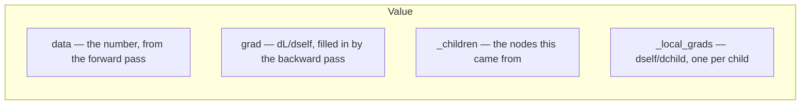
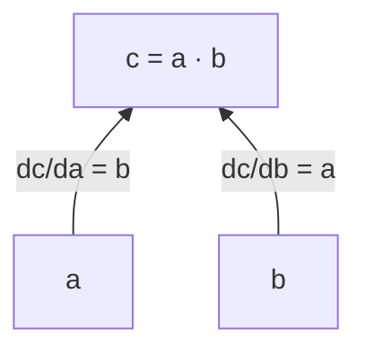
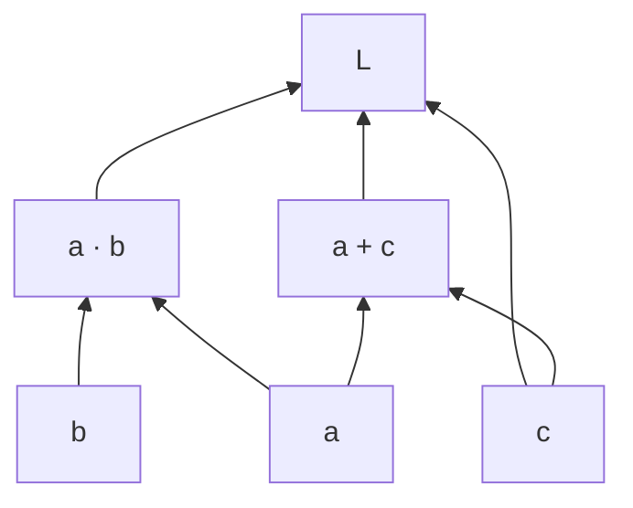

---
jupytext:
  text_representation:
    extension: .md
    format_name: myst
    format_version: 0.13
kernelspec:
  display_name: LightningcatcherGPT
  language: python
  name: lcgpt
---

# 02 — Derivatives, computation graphs & gradient descent

Covers `karpathy.py` lines 71–113 (the `Value` autograd class) and 184–187 plus
211–219 (Adam). This is the calculus at the centre of the file: everything else is
arithmetic arranged so that these forty-odd lines can differentiate it.

Code cells reproduce the source verbatim, dedented where a fragment sits inside a
function or a loop.

+++

## 2.1 The `Value` node — lines 71–79

A `Value` is one scalar in a computation graph. It stores its own number (`data`),
a slot for the derivative of the final loss with respect to it (`grad`), the nodes
it was computed from (`_children`), and — the key design choice — the local
derivative of itself with respect to each of those children (`_local_grads`),
recorded at the moment the operation happens.

Nothing here knows what a loss is. Each node only knows its immediate neighbours.



```{code-cell} ipython3
# Let there be Autograd to recursively apply the chain rule through a computation graph
class Value:
    __slots__ = ('data', 'grad', '_children', '_local_grads') # Python optimization for memory usage

    def __init__(self, data, children=(), local_grads=()):
        self.data = data                # scalar value of this node calculated during forward pass
        self.grad = 0                   # derivative of the loss w.r.t. this node, calculated in backward pass
        self._children = children       # children of this node in the computation graph
        self._local_grads = local_grads # local derivative of this node w.r.t. its children
```

## 2.2 Binary operations — lines 81–87

Addition and multiplication each build a new node with two children, and record the
two partial derivatives alongside them. That is the whole trick: the derivative
rule is captured during the forward pass, while the operands are still in hand.

$$
c = a + b \;\Longrightarrow\;
\frac{\partial c}{\partial a} = 1,\quad \frac{\partial c}{\partial b} = 1
$$

$$
c = a \cdot b \;\Longrightarrow\;
\frac{\partial c}{\partial a} = b,\quad \frac{\partial c}{\partial b} = a
$$

which is exactly `(1, 1)` and `(other.data, self.data)` in the code below.



```{code-cell} ipython3
def __add__(self, other):
    other = other if isinstance(other, Value) else Value(other)
    return Value(self.data + other.data, (self, other), (1, 1))

def __mul__(self, other):
    other = other if isinstance(other, Value) else Value(other)
    return Value(self.data * other.data, (self, other), (other.data, self.data))
```

## 2.3 Unary operations — lines 89–92

Four single-child nodes, each a one-liner pairing a value with its derivative.

$$
\frac{d}{da}a^{n} = n\,a^{n-1}, \qquad
\frac{d}{da}\log a = \frac{1}{a}, \qquad
\frac{d}{da}e^{a} = e^{a}, \qquad
\frac{d}{da}\mathrm{relu}(a) = \begin{cases} 1 & a > 0 \\ 0 & a \le 0 \end{cases}
$$

ReLU has no derivative at exactly $a = 0$; the code picks $0$ there, which is the
conventional choice and never matters in practice.

```{code-cell} ipython3
def __pow__(self, other): return Value(self.data**other, (self,), (other * self.data**(other-1),))
def log(self): return Value(math.log(self.data), (self,), (1/self.data,))
def exp(self): return Value(math.exp(self.data), (self,), (math.exp(self.data),))
def relu(self): return Value(max(0, self.data), (self,), (float(self.data > 0),))
```

## 2.4 Operators derived from the primitives — lines 93–99

None of these record a derivative, because none of them are new operations — each
is rewritten in terms of `__add__`, `__mul__` and `__pow__`, which already know
their own rules. Negation is multiplication by $-1$; subtraction is addition of a
negation; division is multiplication by a $-1$ power.

The reflected forms exist so a plain Python number can appear on the left.
`__radd__` in particular is load-bearing: `sum()` starts its accumulation at the
integer `0`, so every `sum(...)` over `Value` objects elsewhere in the file goes
through it.

```{code-cell} ipython3
def __neg__(self): return self * -1
def __radd__(self, other): return self + other
def __sub__(self, other): return self + (-other)
def __rsub__(self, other): return other + (-self)
def __rmul__(self, other): return self * other
def __truediv__(self, other): return self * other**-1
def __rtruediv__(self, other): return other * self**-1
```

## 2.5 `backward()` — lines 101–114

The graph was built forward, one operation at a time, and each node already knows
its local derivatives. Turning that into $\partial L / \partial \theta$ for every
parameter takes two steps: put the nodes in an order where every node comes after
everything it depends on, then walk that order backwards, handing each node's
gradient down to its children by the chain rule.

$$
\frac{\partial L}{\partial c} \mathrel{+}= \frac{\partial v}{\partial c} \cdot \frac{\partial L}{\partial v}
\qquad \text{for each child } c \text{ of } v
$$

Two details carry the weight. The accumulation is `+=`, not `=`, because a node can
feed several parents and every path contributes. And the topological order is what
guarantees that when the loop reaches a node, every parent has already deposited
its share, so `v.grad` is final before it is used.

The seed is `self.grad = 1`: the derivative of the loss with respect to itself.

> Called once per training step at line 209 — notebook 05, §5.6.



Above, `a` reaches `L` by two paths, so its gradient is the sum of two
contributions — which is why `+=` is not an optimisation but a correctness
requirement.

```{code-cell} ipython3
def backward(self):
    topo = []
    visited = set()
    def build_topo(v):
        if v not in visited:
            visited.add(v)
            for child in v._children:
                build_topo(child)
            topo.append(v)
    build_topo(self)
    self.grad = 1
    for v in reversed(topo):
        for child, local_grad in zip(v._children, v._local_grads):
            child.grad += local_grad * v.grad
```

## 2.6 Adam's buffers — lines 184–187

Gradient descent in its plainest form steps along $-\nabla L$. Adam keeps two
running averages per parameter instead: `m`, an exponentially decayed mean of the
gradient, and `v`, an exponentially decayed mean of its square.

$$
m_t = \beta_1 m_{t-1} + (1 - \beta_1)\, g_t, \qquad
v_t = \beta_2 v_{t-1} + (1 - \beta_2)\, g_t^{2}
$$

`params` flattens every weight matrix into one list, which is what the optimiser
iterates over — the same `Value` objects the model reads, so updating them here
updates the model. The buffers themselves are plain floats, not `Value`s: the
optimiser sits outside the computation graph and must not be differentiated.

$\beta_1$, $\beta_2$ and $\epsilon$ come from `CONFIG_DEFAULTS` (§3.1 of notebook
03), which is also where the learning rate lives.

```{code-cell} ipython3
# Let there be Adam, the blessed optimizer and its buffers
params = [p for mat in config['state_dict'].values() for row in mat for p in row]
m = [0.0] * len(params) # first moment buffer
v = [0.0] * len(params) # second moment buffer
```

## 2.7 The Adam update — lines 211–219

Both buffers start at zero, which biases them toward zero for the first several
steps. Dividing by $1 - \beta^{t}$ corrects for exactly that, and matters most when
$t$ is small:

$$
\hat{m}_t = \frac{m_t}{1 - \beta_1^{\,t}}, \qquad
\hat{v}_t = \frac{v_t}{1 - \beta_2^{\,t}}, \qquad
\theta \leftarrow \theta - \eta_t \frac{\hat{m}_t}{\sqrt{\hat{v}_t} + \epsilon}
$$

with the learning rate decaying linearly to zero over training:

$$
\eta_t = \eta_0 \left(1 - \frac{t}{T}\right)
$$

Dividing by $\sqrt{\hat v}$ is what makes the step size roughly scale-free: a
parameter with consistently large gradients does not get a correspondingly large
step. The code uses `step + 1` for $t$ because steps are zero-indexed, and clears
`p.grad` at the end so the next backward pass accumulates from zero.

> Shown again in situ as §5.7 of notebook 05, inside the training loop.

```{code-cell} ipython3
# Adam optimizer update: update the model parameters based on the corresponding gradients
lr_t = learning_rate * (1 - step / num_steps) # linear learning rate decay
for i, p in enumerate(params):
    m[i] = beta1 * m[i] + (1 - beta1) * p.grad
    v[i] = beta2 * v[i] + (1 - beta2) * p.grad ** 2
    m_hat = m[i] / (1 - beta1 ** (step + 1))
    v_hat = v[i] / (1 - beta2 ** (step + 1))
    p.data -= lr_t * m_hat / (v_hat ** 0.5 + eps_adam)
    p.grad = 0
```

## 2.8 Gradient descent, on its own

Not from the source. The smallest thing that exercises everything above: a scalar
function with a known minimum, descended by hand. The graph is rebuilt from scratch
each step, exactly as the training loop rebuilds the model's graph for every
document.

```{code-cell} ipython3
# Not from the source: minimise f(x) = (x - 3)^2, whose minimum is obviously at x = 3.
import sys; sys.path.insert(0, '..')   # karpathy.py lives one level up
from karpathy import Value

x = Value(-2.0)
lr = 0.1

for step in range(30):
    y = (x - 3.0) ** 2   # forward: build a fresh graph
    x.grad = 0           # clear last step's gradient
    y.backward()         # backward: fill in dy/dx
    x.data -= lr * x.grad
    if step % 5 == 0 or step == 29:
        print(f"step {step:2d} | x {x.data:+.5f} | f(x) {y.data:.6f} | df/dx {x.grad:+.5f}")
```
