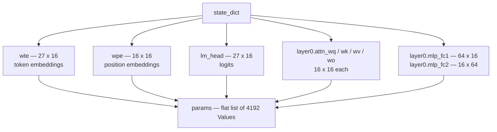
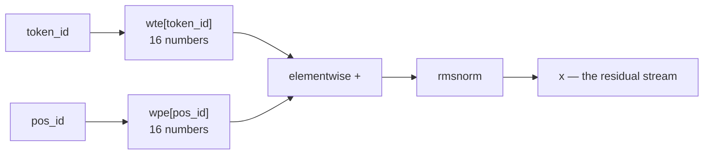
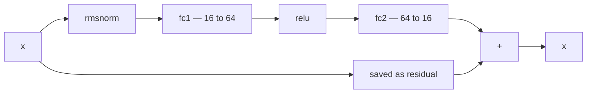
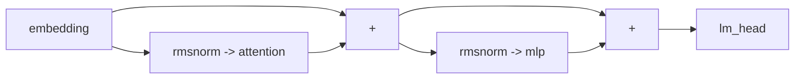

---
jupytext:
  text_representation:
    extension: .md
    format_name: myst
    format_version: 0.13
kernelspec:
  display_name: LightningcatcherGPT
  language: python
  name: lcgpt
---

# 03 — The transformer block

Covers `karpathy_gpt.py` lines 73–111 and 134–143: the model's parameters, the
three helper functions, the embeddings, the MLP, the residual stream, and the
output head.

There is a deliberate hole in the middle. Lines 113–133 are the attention block,
and they get notebook 04 to themselves. Everything here is what surrounds
attention — which turns out to be most of the architecture.

Code cells reproduce the source verbatim, dedented where a fragment sits inside a
function or a loop.

+++

## 3.1 Configuration — lines 73–78

Six numbers fix the entire model. `n_embd` is the width of the vector that flows
through the network; `n_layer` is how many times the block repeats; `n_head` is
how many attention heads split that width between them:

$$
\texttt{head\_dim} = \frac{\texttt{n\_embd}}{\texttt{n\_head}} = \frac{16}{4} = 4
$$

`block_size = 16` is the context window, sized to the data in §1.4. A real GPT-2
uses the same six knobs with bigger numbers — 12 layers, width 768, 12 heads.

```{code-cell} ipython3
# Initialize the parameters, to store the knowledge of the model
n_layer = 1     # depth of the transformer neural network (number of layers)
n_embd = 16     # width of the network (embedding dimension)
block_size = 16 # maximum context length of the attention window (note: the longest name is 15 characters)
n_head = 4      # number of attention heads
head_dim = n_embd // n_head # derived dimension of each head
```

## 3.2 Parameters — lines 79–89

`matrix` builds a list of lists of `Value`s drawn from a Gaussian with standard
deviation 0.08 — small, so early activations stay in a sane range. Every weight
in the model is created here and nowhere else.

`state_dict` names them; `params` is the same objects flattened into one list,
which is what the optimiser iterates over. The two views share objects, so
updating a `Value` through `params` updates the model.

Counting them:

$$
\underbrace{27 \times 16}_{\texttt{wte}} +
\underbrace{16 \times 16}_{\texttt{wpe}} +
\underbrace{27 \times 16}_{\texttt{lm\_head}} +
\underbrace{4 \times (16 \times 16)}_{\texttt{wq,wk,wv,wo}} +
\underbrace{64 \times 16 + 16 \times 64}_{\texttt{mlp}} = 4192
$$



```{code-cell} ipython3
matrix = lambda nout, nin, std=0.08: [[Value(random.gauss(0, std)) for _ in range(nin)] for _ in range(nout)]
state_dict = {'wte': matrix(vocab_size, n_embd), 'wpe': matrix(block_size, n_embd), 'lm_head': matrix(vocab_size, n_embd)}
for i in range(n_layer):
    state_dict[f'layer{i}.attn_wq'] = matrix(n_embd, n_embd)
    state_dict[f'layer{i}.attn_wk'] = matrix(n_embd, n_embd)
    state_dict[f'layer{i}.attn_wv'] = matrix(n_embd, n_embd)
    state_dict[f'layer{i}.attn_wo'] = matrix(n_embd, n_embd)
    state_dict[f'layer{i}.mlp_fc1'] = matrix(4 * n_embd, n_embd)
    state_dict[f'layer{i}.mlp_fc2'] = matrix(n_embd, 4 * n_embd)
params = [p for mat in state_dict.values() for row in mat for p in row] # flatten params into a single list[Value]
print(f"num params: {len(params)}")
```

## 3.3 `linear` — lines 91–94

The two comment lines are the architecture's entire specification: GPT-2, with
LayerNorm swapped for RMSNorm, GeLU for ReLU, and every bias removed. Everything
from here to line 143 is those three substitutions applied to a standard design.

`linear` itself is a matrix–vector product, written as one comprehension. Each
output is a dot product of one row of $W$ with the input:

$$
y_i = \sum_j W_{ij}\, x_j
$$

There is no bias term anywhere in this model — a deliberate simplification noted
in the header comment, and one that modern models increasingly share.

```{code-cell} ipython3
# Define the model architecture: a function mapping tokens and parameters to logits over what comes next
# Follow GPT-2, blessed among the GPTs, with minor differences: layernorm -> rmsnorm, no biases, GeLU -> ReLU
def linear(x, w):
    return [sum(wi * xi for wi, xi in zip(wo, x)) for wo in w]
```

## 3.4 `rmsnorm` — lines 102–105

Rescales a vector to unit root-mean-square, so the numbers flowing through the
network keep a consistent magnitude no matter what the layers do to them:

$$
\mathrm{RMSNorm}(x)_i = \frac{x_i}{\sqrt{\dfrac{1}{d}\sum_{j} x_j^{2} + \epsilon}}
$$

Two differences from GPT-2's LayerNorm: no mean is subtracted, and there is no
learnable gain or bias — this version has no parameters at all. The $\epsilon =
10^{-5}$ keeps the reciprocal square root finite if $x$ is all zeros.

```{code-cell} ipython3
def rmsnorm(x):
    ms = sum(xi * xi for xi in x) / len(x)
    scale = (ms + 1e-5) ** -0.5
    return [xi * scale for xi in x]
```

## 3.5 Embeddings — lines 107–111

The model's input is two integers: which token, and where it sits. Each indexes a
row of a learned matrix, and the two rows are added. From here on the token's
identity and its position are the same sixteen numbers, indistinguishable to
everything downstream.

The `rmsnorm` on line 111 looks redundant — the next thing the block does is
normalise again. The comment explains why it stays: the residual connection
carries `x` forward unnormalised, so this call is not on a path that gets
normalised twice, and it changes the gradients.



```{code-cell} ipython3
def gpt(token_id, pos_id, keys, values):
    tok_emb = state_dict['wte'][token_id] # token embedding
    pos_emb = state_dict['wpe'][pos_id] # position embedding
    x = [t + p for t, p in zip(tok_emb, pos_emb)] # joint token and position embedding
    x = rmsnorm(x) # note: not redundant due to backward pass via the residual connection
```

## 3.6 The MLP block — lines 134–140

The same shape as the attention block: save the stream, normalise a copy, do
work, add the result back. The work here is a two-layer network that widens to
$4 \times 16 = 64$, applies ReLU, and projects back to 16.

$$
\mathrm{MLP}(x) = W_{2}\,\mathrm{relu}(W_{1} x)
$$

The widening is where most of the model's parameters live (2048 of 4192). GPT-2
uses the same 4× factor, with GeLU in place of ReLU. Attention moves information
between positions; this moves it between dimensions, one position at a time.



```{code-cell} ipython3
# 2) MLP block
x_residual = x
x = rmsnorm(x)
x = linear(x, state_dict[f'layer{li}.mlp_fc1'])
x = [xi.relu() for xi in x]
x = linear(x, state_dict[f'layer{li}.mlp_fc2'])
x = [a + b for a, b in zip(x, x_residual)]
```

## 3.7 The residual stream — lines 133 and 140

Worth pulling out on its own, because it is the reason deep transformers train at
all. Neither block replaces `x`; each computes a correction and adds it. The
un-normalised stream runs from the embedding straight through to `lm_head`,
untouched, with blocks writing into it along the way.

In the backward pass an addition passes gradient through unchanged — its local
derivative is $1$ — so there is always a direct path from the loss back to the
embeddings that does not attenuate through any layer.

$$
x \leftarrow x + \mathrm{Attn}(\mathrm{rmsnorm}(x)), \qquad
x \leftarrow x + \mathrm{MLP}(\mathrm{rmsnorm}(x))
$$

> Line 133 is also the closing line of §4.8, and line 140 the closing line of
> §3.6 above; they are shown together here because the pattern is the point.



```{code-cell} ipython3
x = [a + b for a, b in zip(x, x_residual)]   # line 133, closing the attention block
x = [a + b for a, b in zip(x, x_residual)]   # line 140, closing the MLP block
```

## 3.8 The output head — lines 142–143

One last matrix, mapping the 16-dimensional stream to one number per vocabulary
entry. Those numbers are *logits* — unnormalised scores, not probabilities.
Nothing turns them into probabilities inside `gpt`; that happens at the call site,
in the loss (§5.4) and in sampling (§5.10).

$$
\text{logits} = W_{\text{lm\_head}}\, x \in \mathbb{R}^{27}
$$

```{code-cell} ipython3
logits = linear(x, state_dict['lm_head'])
return logits
```
