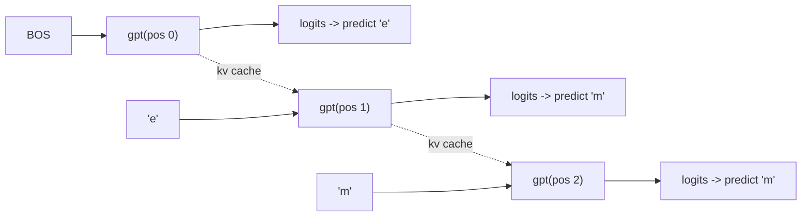
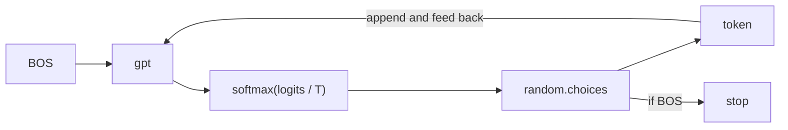

---
jupytext:
  text_representation:
    extension: .md
    format_name: myst
    format_version: 0.13
    jupytext_version: 1.19.5
kernelspec:
  display_name: LightningcatcherGPT
  language: python
  name: lcgpt
---

# 05 — Loss & training

Covers `karpathy_gpt.py` lines 150–199: the training loop and inference. This is
where the pieces from notebooks 01–04 are assembled into something that learns.

Several sections here re-show code that was the subject of an earlier notebook.
That is deliberate — the point of this notebook is the assembly, and each cell
says where the piece was first taken apart.

Code cells reproduce the source verbatim, dedented where a fragment sits inside a
function or a loop.

+++

## 5.1 The loop — lines 150–152

One thousand steps, one document per step. Note what is absent: no batching, no
epochs, no validation split, no checkpointing, no early stopping. At 32,032
names and one per step, training sees about 3% of the corpus and never revisits
a name.

```{code-cell} ipython3
# Repeat in sequence
num_steps = 1000 # number of training steps
for step in range(num_steps):
```

## 5.2 One document, tokenized — lines 154–157

`docs` was shuffled at load time (§1.2), so walking it in order is already a
random order. The document is wrapped in BOS at both ends: the leading one gives
position 0 something to condition on, and the trailing one is the target that
teaches the model to stop.

$$
n = \min(\texttt{block\_size},\; |\text{tokens}| - 1)
$$

The $-1$ is because the last token is only ever a target, never an input.

> The encoder on line 156 is §1.5 of notebook 01, where it is examined on its own.

```{code-cell} ipython3
# Take single document, tokenize it, surround it with BOS special token on both sides
doc = docs[step % len(docs)]
tokens = [BOS] + [uchars.index(ch) for ch in doc] + [BOS]
n = min(block_size, len(tokens) - 1)
```

## 5.3 The forward pass — lines 159–164

A fresh KV cache per document — the model must not attend across documents. Then
one `gpt` call per position, each appending to the cache and each returning
logits for what should come next.

Every position is a training example: `emma` supplies five of them at once
(`BOS`→`e`, `e`→`m`, `m`→`m`, `m`→`a`, `a`→`BOS`). This is why language models
are so sample-efficient per document, and why no explicit labels are needed —
the text is its own supervision.



```{code-cell} ipython3
# Forward the token sequence through the model, building up the computation graph all the way to the loss
keys, values = [[] for _ in range(n_layer)], [[] for _ in range(n_layer)]
losses = []
for pos_id in range(n):
    token_id, target_id = tokens[pos_id], tokens[pos_id + 1]
    logits = gpt(token_id, pos_id, keys, values)
```

## 5.4 Cross-entropy — lines 165–167

The logits become a distribution, and the loss is the negative log of the
probability assigned to the token that actually came next:

$$
p = \mathrm{softmax}(\text{logits}), \qquad
\ell_t = -\log p_{\,y_t}
$$

Nothing else in the distribution appears in the formula. The other 26
probabilities are punished only indirectly, through the denominator inside the
softmax — pushing them down is the only way to push $p_{y_t}$ up.

A useful reference point: an untrained model spreads its mass evenly, giving
$-\log(1/27) \approx 3.30$. That is very close to the loss at step 1, and the
number to measure progress against.

> `softmax` itself is §4.1 of notebook 04.

```{code-cell} ipython3
probs = softmax(logits)
loss_t = -probs[target_id].log()
losses.append(loss_t)
```

## 5.5 Averaging over the document — line 168

$$
L = \frac{1}{n} \sum_{t=0}^{n-1} \ell_t
$$

Averaging rather than summing means a long name and a short name contribute
comparably, instead of long names dominating simply by having more positions.

This single `Value` is the root of a computation graph containing every operation
performed on this document — some tens of thousands of nodes.

```{code-cell} ipython3
loss = (1 / n) * sum(losses) # final average loss over the document sequence. May yours be low.
```

## 5.6 Backward — lines 170–171

One call. It walks the graph built by the forward pass and leaves
$\partial L / \partial p$ in `p.grad` for all 4192 parameters.

Worth pausing on the asymmetry: the forward pass took twenty lines of model code
to write, and the backward pass took none. Nobody derived a gradient for
attention, or for RMSNorm, or for the residual connections. Each operation
recorded its own local derivative as it happened, and the chain rule assembled
them.

> `backward()` is §2.5 of notebook 02.

```{code-cell} ipython3
# Backward the loss, calculating the gradients with respect to all model parameters
loss.backward()
```

## 5.7 The optimiser step — lines 173–181

The gradients from §5.6 are consumed here and cleared, ready for the next
document.

> Adam is §2.6 and §2.7 of notebook 02, where the update rule and its bias
> correction are worked through. This cell is the same code in its place.

```{code-cell} ipython3
# Adam optimizer update: update the model parameters based on the corresponding gradients
lr_t = learning_rate * (1 - step / num_steps) # linear learning rate decay
for i, p in enumerate(params):
    m[i] = beta1 * m[i] + (1 - beta1) * p.grad
    v[i] = beta2 * v[i] + (1 - beta2) * p.grad ** 2
    m_hat = m[i] / (1 - beta1 ** (step + 1))
    v_hat = v[i] / (1 - beta2 ** (step + 1))
    p.data -= lr_t * m_hat / (v_hat ** 0.5 + eps_adam)
    p.grad = 0
```

## 5.8 Watching it train — line 183

The `end='\r'` overwrites the line, so a thousand steps scroll in place.

What the number does is worth knowing in advance. It is the loss on a *single
document*, so it is extremely noisy — consecutive steps swing between roughly 1.7
and 3.8 for the whole run, because some names are far more predictable than
others. The trend is real but only visible smoothed: averaged in blocks of 100,
it falls from about 2.77 to about 2.28 over the run. Plotting the raw per-step
value produces something that looks like noise and is.

```{code-cell} ipython3
print(f"step {step+1:4d} / {num_steps:4d} | loss {loss.data:.4f}", end='\r')
```

## 5.9 Inference — lines 185–187

Temperature rescales the logits before the softmax:

$$
p_i \;\propto\; \exp\!\left(\frac{z_i}{T}\right)
$$

As $T \to 0$ the distribution concentrates on the single highest logit and
sampling becomes deterministic; at $T = 1$ it is the model's distribution
unmodified; above 1 it flattens toward uniform. At $T = 0.5$ the model is held
fairly close to its confident predictions — names that look typical rather than
inventive.

```{code-cell} ipython3
# Inference: may the model babble back to us
temperature = 0.5 # in (0, 1], control the "creativity" of generated text, low to high
print("\n--- inference (new, hallucinated names) ---")
```

## 5.10 Sampling — lines 188–199

The loop that makes the whole thing a generative model. Start from BOS with an
empty cache, sample a token from the model's distribution, feed it back in as the
next input, stop when the model produces BOS.

Note that the sampled token is fed back as an integer, not as a probability
distribution — the model conditions on what it actually committed to. And note
`p.data`: sampling steps outside the computation graph entirely, because at
inference there is nothing to differentiate.

> The decode on line 198 is §1.6 of notebook 01.



```{code-cell} ipython3
for sample_idx in range(20):
    keys, values = [[] for _ in range(n_layer)], [[] for _ in range(n_layer)]
    token_id = BOS
    sample = []
    for pos_id in range(block_size):
        logits = gpt(token_id, pos_id, keys, values)
        probs = softmax([l / temperature for l in logits])
        token_id = random.choices(range(vocab_size), weights=[p.data for p in probs])[0]
        if token_id == BOS:
            break
        sample.append(uchars[token_id])
    print(f"sample {sample_idx+1:2d}: {''.join(sample)}")
```
