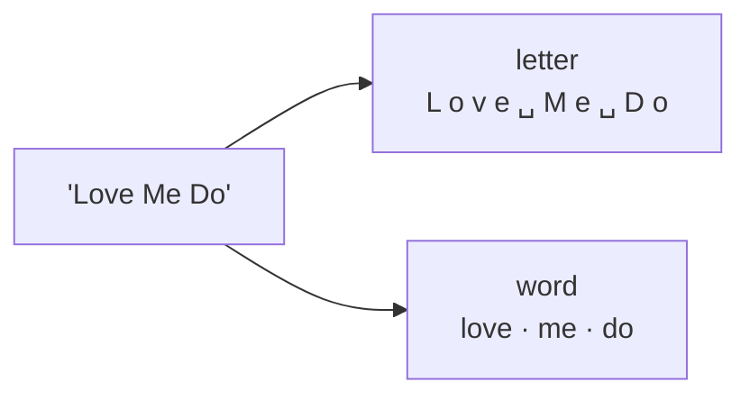
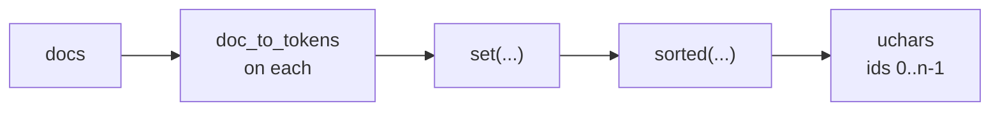
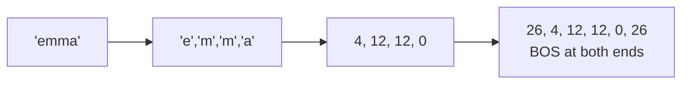

---
jupytext:
  text_representation:
    extension: .md
    format_name: myst
    format_version: 0.13
    jupytext_version: 1.19.5
kernelspec:
  display_name: LightningcatcherGPT
  language: python
  name: lcgpt
---

# 01 — Tokenization

Covers `karpathy.py` lines 1–2, 6, 29–34 and 62–69: turning strings into integers
and back again.

The corpus plumbing that used to live here — locating a file, reading it, shuffling
it — now sits in `lcgpt.py`, outside the algorithm proper. What remains is the part
the model actually depends on.

Code cells reproduce the source verbatim, dedented where a fragment sits inside a
function. Anything that is *not* from the source is marked as such.

+++

## 1.1 What it takes to build a GPT — lines 1–2

Two standard-library modules. `math` for `log` and `exp`; `random` for weight
initialisation and sampling. No tensors, no array library, no accelerator.

```{code-cell} ipython3
import math
import random
```

## 1.2 Splitting a document into tokens — lines 6, 62–66

A *token* is whatever unit the model treats as indivisible. Two choices here:

- **`letter`** — one character per token. `list(doc)` and nothing more.
- **`word`** — whitespace-separated, lowercased, with the curly apostrophe folded
  onto the straight one and punctuation trimmed off each end, so that `"Yeah,"`,
  `"yeah"` and `"yeah!"` collapse to a single token rather than three.

The choice changes only how many distinct tokens exist. Nothing downstream of this
function can tell the difference.



```{code-cell} ipython3
WORD_TRIM = '!"\'(),-.?—'

def doc_to_tokens(doc, token_type):
    if token_type == 'letter':
        return list(doc)
    cleaned = (w.strip(WORD_TRIM) for w in doc.lower().replace('’', "'").split())
    return [w for w in cleaned if w]
```

## 1.3 Joining tokens back into text — lines 68–69

The inverse, and the one place the two token types need different handling:
characters butt together, words need spaces between them.

```{code-cell} ipython3
def tokens_to_text(tokens, token_type):
    return ('' if token_type == 'letter' else ' ').join(tokens)
```

## 1.4 Building the vocabulary — lines 29–30

Every distinct token in the corpus, sorted. A token's id is its index in `uchars`,
which makes encoding a lookup and decoding an index.

Note what this implies: the vocabulary is a property of *the documents you trained
on*, not of the language. Train on three names and you get a handful of letters;
train on the whole file and you get twenty-six.



```{code-cell} ipython3
# Let there be a Tokenizer to translate strings to sequences of integers ("tokens") and back
config['uchars'] = sorted({t for d in docs for t in doc_to_tokens(d, token_type)}) # unique tokens become ids 0..n-1
```

## 1.5 BOS and the vocabulary size — lines 33–34

One id is added beyond the tokens that actually occur: **BOS**, which marks both
the start and the end of a document. It has no character and never appears in the
corpus — it exists so the model has something to condition on at position 0, and
something to predict when the document should stop.

$$
\texttt{BOS} = |\mathcal{U}|, \qquad \texttt{vocab\_size} = |\mathcal{U}| + 1
$$

> These two lines also appear in §3.3 of notebook 03, alongside `head_dim`, where
> the subject is the derived quantities rather than the tokenizer.

```{code-cell} ipython3
config['vocab_size'] = len(config['uchars']) + 1             # +1 is for BOS
config['BOS'] = len(config['uchars'])                        # id of the Beginning of Sequence token
```

## 1.6 Encode, in action — lines 193–194

The encoder is one line, inside the training loop. `uchars.index(tok)` is a linear
scan — fine at 27 tokens, and the thing a real tokenizer replaces with a dict once
the vocabulary runs to tens of thousands.

> Shown again in context as §5.3 of notebook 05.



```{code-cell} ipython3
doc = docs[step % len(docs)]
tokens = [BOS] + [uchars.index(tok) for tok in doc_to_tokens(doc, token_type)] + [BOS]
```

## 1.7 Decode, in action — lines 250–251

The inverse index, then a join. Note what is *not* decoded: BOS has no character,
so the sampling loop breaks on it rather than appending anything.

> Shown again in context as §5.10 of notebook 05.

```{code-cell} ipython3
    sample.append(uchars[token_id])
text = tokens_to_text(sample, token_type)
```

## 1.8 A Shannon n-gram baseline

Not from the source. Once the corpus is tokenized we already have everything
needed to generate text by counting, with no neural network anywhere. Count how
often each token follows each context of length $n-1$, then sample from those
counts:

$$
P(t_i \mid t_{i-n+1}, \ldots, t_{i-1}) \;=\;
\frac{C(t_{i-n+1}, \ldots, t_{i-1}, t_i)}
     {\sum_{t} C(t_{i-n+1}, \ldots, t_{i-1}, t)}
$$

Shannon did this with a book and a pencil in 1948. Watch it go from gibberish at
$n = 1$ to strikingly name-like by $n = 3$ or $4$ — before any training has
happened. This is the baseline the GPT has to beat, and it is worth remembering
how cheap it was.

```{code-cell} ipython3
# Not from the source: an n-gram counter and sampler, in the spirit of Shannon (1948).
import sys; sys.path.insert(0, '..')   # karpathy.py and lcgpt.py live one level up

import random
from collections import Counter, defaultdict

import karpathy
import lcgpt

docs = lcgpt.load_docs_textfile('../data/names.txt', num_docs=5000, seed=42)
uchars = sorted({t for d in docs for t in karpathy.doc_to_tokens(d, 'letter')})
BOS = len(uchars)

def count_ngrams(docs, n):
    """Map each (n-1)-token context to a Counter over the tokens that follow it."""
    counts = defaultdict(Counter)
    for doc in docs:
        tokens = [BOS] + [uchars.index(t) for t in karpathy.doc_to_tokens(doc, 'letter')] + [BOS]
        for i in range(len(tokens) - 1):
            context = tuple(tokens[max(0, i - n + 2):i + 1])
            counts[context][tokens[i + 1]] += 1
    return counts

def ngram_sample(counts, n, max_len=16):
    tokens = [BOS]
    while len(tokens) < max_len:
        context = tuple(tokens[max(0, len(tokens) - n + 1):])
        following = counts.get(context)
        if not following:
            break
        nxt = random.choices(list(following), weights=list(following.values()))[0]
        if nxt == BOS:
            break
        tokens.append(nxt)
    return ''.join(uchars[t] for t in tokens[1:])

random.seed(42)
for n in range(1, 6):
    counts = count_ngrams(docs, n)
    print(f"n={n}: {'  '.join(ngram_sample(counts, n) for _ in range(8))}")
```

## 1.9 A word-level corpus — PLACEHOLDER

**Not designed yet.** The *mechanism* exists — `doc_to_tokens(doc, 'word')` in §1.2,
and `--token-type word` on the command line — and swapping it changes nothing
downstream: same `Value` class, same forward pass, same training loop, only a
larger vocabulary. What is undecided is the demo built on top of it: which corpus,
what it should show, and whether it runs to convergence or stops at a
proof-of-concept.

```{code-cell} ipython3
# PLACEHOLDER — the shape of the swap, for reference only.
#
#   docs   = lcgpt.load_docs_textfile('../data/beatles_first3.txt')
#   config = karpathy.new_model_config(docs, token_type='word', seed=42)
#
# On that corpus the vocabulary goes from 61 letter-tokens to 612 word-tokens and
# the parameter count from 5,280 to 22,912, because `wte` and `lm_head` are both
# sized by vocabulary. Nothing else in the code changes.
```
