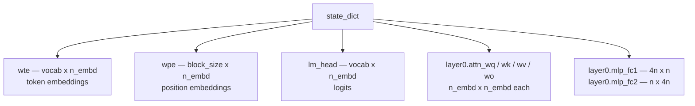
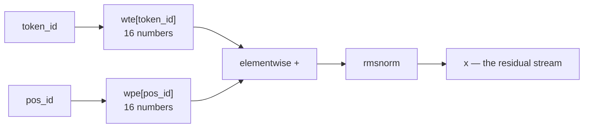
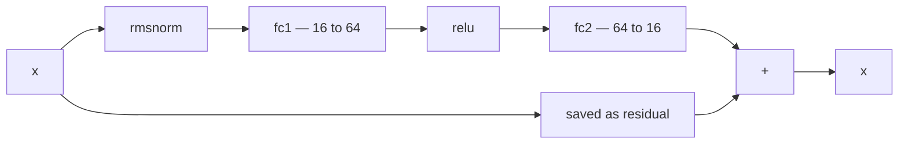
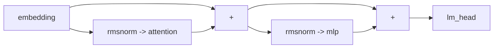

---
jupytext:
  text_representation:
    extension: .md
    format_name: myst
    format_version: 0.13
    jupytext_version: 1.19.5
kernelspec:
  display_name: LightningcatcherGPT
  language: python
  name: lcgpt
---

# 03 — The transformer block

Covers `karpathy.py` lines 8–20, 23–28, 32–59, 116–119, 127–139 and 161–171: the
model's configuration, its parameters, two of the three helper functions, the
embeddings, the MLP, the residual stream and the output head.

There is a deliberate hole in the middle. Lines 141–160 are the attention block,
and they get notebook 04 to themselves. Everything here is what surrounds
attention — which turns out to be most of the architecture.

Code cells reproduce the source verbatim, dedented where a fragment sits inside a
function or a loop.

+++

## 3.1 The configuration — lines 8–20

Four numbers fix the entire architecture. `n_embd` is the width of the vector that
flows through the network; `n_layer` is how many times the block repeats; `n_head`
is how many attention heads split that width between them; `block_size` is how far
back the model can attend.

The remaining four entries — the learning rate and Adam's $\beta_1$, $\beta_2$,
$\epsilon$ — describe *training* rather than the model, and are notebook 02's
subject (§2.6, §2.7). They ride along in the same dict for convenience, and are
deliberately not written to the model file.

A real GPT-2 uses the same architectural knobs with bigger numbers: 12 layers,
width 768, 12 heads, context 1024.

```{code-cell} ipython3
# The architecture. Overridable via new_config(**overrides), but these are the
# numbers the notebooks describe and the anchor hard-codes.
CONFIG_DEFAULTS = {
    'n_layer': 1,     # depth of the transformer neural network (number of layers)
    'n_embd': 16,     # width of the network (embedding dimension)
    'block_size': 16, # maximum context length of the attention window
    'n_head': 4,      # number of attention heads
    'token_type': 'letter',
    'learning_rate': 0.01, 
    'beta1': 0.85, 
    'beta2': 0.99, 
    'eps_adam': 1e-8
}
```

## 3.2 Assembling a config — lines 23–28

A *config* is a plain dict carrying hyperparameters, tokenizer and weights
together. It starts as a copy of the defaults — `.copy()`, so that overrides never
leak back into the module-level dict — then takes any `**overrides` the caller
passed.

`seed` makes initialisation reproducible: pass one and the same weights come out
every time, which is what lets a notebook cell be re-run without the numbers
moving underneath it.

```{code-cell} ipython3
def new_model_config(docs, token_type='letter', verbose=True, seed=None, **overrides):
    """Build a tokenizer from `docs` and initialise a fresh set of weights."""
    config = CONFIG_DEFAULTS.copy()
    config.update(overrides)
    config['token_type'] = token_type
    random.seed(seed)
```

## 3.3 Derived quantities — lines 32–34

Three values that are implied by the others rather than chosen. Because a config is
a plain dict it cannot recompute them itself, so they are set here, once, wherever a
config is built.

$$
\texttt{head\_dim} = \frac{\texttt{n\_embd}}{\texttt{n\_head}} = \frac{16}{4} = 4
$$

> `vocab_size` and `BOS` are §1.5 of notebook 01, where the subject is the
> tokenizer rather than the architecture.

```{code-cell} ipython3
config['head_dim'] = config['n_embd'] // config['n_head']    # derived dimension of each head
config['vocab_size'] = len(config['uchars']) + 1             # +1 is for BOS
config['BOS'] = len(config['uchars'])                        # id of the Beginning of Sequence token
```

## 3.4 Parameter initialisation — lines 36–59

`matrix` builds a list of lists of `Value`s drawn from a Gaussian with standard
deviation 0.08 — small, so early activations stay in a sane range. Every weight in
the model is created here and nowhere else.

Counting them at the default size, with a 27-token vocabulary:

$$
\underbrace{27 \times 16}_{\texttt{wte}} +
\underbrace{16 \times 16}_{\texttt{wpe}} +
\underbrace{27 \times 16}_{\texttt{lm\_head}} +
\underbrace{4 \times (16 \times 16)}_{\texttt{wq,wk,wv,wo}} +
\underbrace{64 \times 16 + 16 \times 64}_{\texttt{mlp}} = 4192
$$

The `verbose` block at the end reports that count, and warns when documents are
longer than `block_size` — they get silently truncated by the `n = min(...)` in
`train`, which is easy to miss on an unfamiliar corpus.



```{code-cell} ipython3
# Initialize the parameters, to store the knowledge of the model
n_embd, vocab_size, block_size = config['n_embd'], config['vocab_size'], config['block_size']
matrix = lambda nout, nin, std=0.08: [[Value(random.gauss(0, std)) for _ in range(nin)] for _ in range(nout)]
state_dict = {'wte': matrix(vocab_size, n_embd), 'wpe': matrix(block_size, n_embd), 'lm_head': matrix(vocab_size, n_embd)}
for i in range(config['n_layer']):
    state_dict[f'layer{i}.attn_wq'] = matrix(n_embd, n_embd)
    state_dict[f'layer{i}.attn_wk'] = matrix(n_embd, n_embd)
    state_dict[f'layer{i}.attn_wv'] = matrix(n_embd, n_embd)
    state_dict[f'layer{i}.attn_wo'] = matrix(n_embd, n_embd)
    state_dict[f'layer{i}.mlp_fc1'] = matrix(4 * n_embd, n_embd)
    state_dict[f'layer{i}.mlp_fc2'] = matrix(n_embd, 4 * n_embd)
config['state_dict'] = state_dict

if verbose:
    print(f"vocab size: {vocab_size} ({token_type} tokens)")
    print(f"Dimensions: {config['n_layer']} x  {config['n_embd']} x {config['n_embd']} ")
    print(f"Num. Params: {len([p for mat in config['state_dict'].values() for row in mat for p in row])}")
    # Documents longer than the context window are silently cut short by the
    # `n = min(block_size, ...)` in train(). Worth saying out loud on an unfamiliar corpus.
    over = sum(1 for d in docs if len(doc_to_tokens(d, token_type)) + 1 > block_size)
    if over:
        print(f"note: {over} of {len(docs)} documents ({100 * over / len(docs):.0f}%) are longer than "
              f"block_size={block_size} and will be truncated")
return config
```

## 3.5 `linear` — lines 116–119

The two comment lines are the architecture's entire specification: GPT-2, with
LayerNorm swapped for RMSNorm, GeLU for ReLU, and every bias removed. Everything
from here to line 171 is those three substitutions applied to a standard design.

`linear` itself is a matrix–vector product written as one comprehension. Each
output is a dot product of one row of $W$ with the input:

$$
y_i = \sum_j W_{ij}\, x_j
$$

```{code-cell} ipython3
# Define the model architecture: a function mapping tokens and parameters to logits over what comes next
# Follow GPT-2, blessed among the GPTs, with minor differences: layernorm -> rmsnorm, no biases, GeLU -> ReLU
def linear(x, w):
    return [sum(wi * xi for wi, xi in zip(wo, x)) for wo in w]
```

## 3.6 `rmsnorm` — lines 127–130

Rescales a vector to unit root-mean-square, so the numbers flowing through the
network keep a consistent magnitude no matter what the layers do to them:

$$
\mathrm{RMSNorm}(x)_i = \frac{x_i}{\sqrt{\dfrac{1}{d}\sum_{j} x_j^{2} + \epsilon}}
$$

Two differences from GPT-2's LayerNorm: no mean is subtracted, and there is no
learnable gain or bias — this version has no parameters at all. The
$\epsilon = 10^{-5}$ keeps the reciprocal square root finite if $x$ is all zeros.

```{code-cell} ipython3
def rmsnorm(x):
    ms = sum(xi * xi for xi in x) / len(x)
    scale = (ms + 1e-5) ** -0.5
    return [xi * scale for xi in x]
```

## 3.7 Embeddings — lines 132–139

The model's input is two integers: which token, and where it sits. Each indexes a
row of a learned matrix, and the two rows are added. From here on the token's
identity and its position are the same sixteen numbers, indistinguishable to
everything downstream.

`gpt` takes the whole config as its first argument and unpacks what it needs, which
is what allows several models to be live at once.

The `rmsnorm` on line 139 looks redundant — the next thing the block does is
normalise again. The comment explains why it stays: the residual connection carries
`x` forward unnormalised, so this call is not on a path that gets normalised twice,
and it changes the gradients.



```{code-cell} ipython3
def gpt(config, token_id, pos_id, keys, values):
    state_dict = config['state_dict']
    n_layer, n_head, head_dim = config['n_layer'], config['n_head'], config['head_dim']

    tok_emb = state_dict['wte'][token_id] # token embedding
    pos_emb = state_dict['wpe'][pos_id] # position embedding
    x = [t + p for t, p in zip(tok_emb, pos_emb)] # joint token and position embedding
    x = rmsnorm(x) # note: not redundant due to backward pass via the residual connection
```

## 3.8 The MLP block — lines 162–168

The same shape as the attention block: save the stream, normalise a copy, do work,
add the result back. The work here is a two-layer network that widens to
$4 \times 16 = 64$, applies ReLU, and projects back to 16.

$$
\mathrm{MLP}(x) = W_{2}\,\mathrm{relu}(W_{1} x)
$$

The widening is where most of the model's parameters live — 2048 of 4192. GPT-2
uses the same 4× factor, with GeLU in place of ReLU. Attention moves information
between positions; this moves it between dimensions, one position at a time.



```{code-cell} ipython3
# 2) MLP block
x_residual = x
x = rmsnorm(x)
x = linear(x, state_dict[f'layer{li}.mlp_fc1'])
x = [xi.relu() for xi in x]
x = linear(x, state_dict[f'layer{li}.mlp_fc2'])
x = [a + b for a, b in zip(x, x_residual)]
```

## 3.9 The residual stream — lines 161 and 168

Worth pulling out on its own, because it is the reason deep transformers train at
all. Neither block replaces `x`; each computes a correction and adds it. The
un-normalised stream runs from the embedding straight through to `lm_head`,
untouched, with blocks writing into it along the way.

In the backward pass an addition passes gradient through unchanged — its local
derivative is $1$ — so there is always a direct path from the loss back to the
embeddings that does not attenuate through any layer.

$$
x \leftarrow x + \mathrm{Attn}(\mathrm{rmsnorm}(x)), \qquad
x \leftarrow x + \mathrm{MLP}(\mathrm{rmsnorm}(x))
$$

> Line 161 is also the closing line of §4.8, and line 168 the closing line of §3.8
> above; they are shown together here because the pattern is the point.



```{code-cell} ipython3
x = [a + b for a, b in zip(x, x_residual)]   # line 161, closing the attention block
x = [a + b for a, b in zip(x, x_residual)]   # line 168, closing the MLP block
```

## 3.10 The output head — lines 170–171

One last matrix, mapping the 16-dimensional stream to one number per vocabulary
entry. Those numbers are *logits* — unnormalised scores, not probabilities. Nothing
turns them into probabilities inside `gpt`; that happens at the call site, in the
loss (§5.5) and in sampling (§5.10).

$$
\text{logits} = W_{\text{lm\_head}}\, x \in \mathbb{R}^{\texttt{vocab\_size}}
$$

```{code-cell} ipython3
logits = linear(x, state_dict['lm_head'])
return logits
```

## 3.11 A model small enough to read

Not from the source. Every section above described a matrix and asked you to
accept that these matrices *are* the model's knowledge. At the default size that
is an assertion — 4,192 numbers is not something you can look at. So shrink the
model until it is.

`new_model_config` takes architecture overrides, so `n_embd=2, n_head=1,
block_size=4` over a three-letter alphabet gives a model of **72 parameters**,
every one of which fits on screen. `seed=` fixes the initialisation, so the numbers
below stay put when the cell is re-run.

The corpus is four documents, deliberately lopsided: `aba` three times and `abc`
once. So after the prefix `ab`, the corpus says `a` three times in four and `c`
once. If the weights really do encode the corpus, the model's predicted
distribution should be exactly that:

$$
P_\theta(t \mid \texttt{ab}) \;=\; \hat{P}_{\text{corpus}}(t \mid \texttt{ab})
\;=\; \left(\tfrac{3}{4},\, 0,\, \tfrac{1}{4},\, 0\right)
$$

Nothing forces this. It is what training *for*.

```{code-cell} ipython3
# Not from the source: the whole model, small enough to print.
import sys; sys.path.insert(0, '..')   # karpathy.py lives one level up
import karpathy

docs = ['aba', 'aba', 'aba', 'abc']    # after "ab": 'a' 3 times in 4, 'c' once
config = karpathy.new_model_config(docs, verbose=False, seed=42,
                                   n_embd=2, n_head=1, block_size=4)
names = config['uchars'] + ['BOS']

def next_token_probs(config, prefix):
    """Run the model over `prefix` and return its distribution over what comes next."""
    keys, values = [[] for _ in range(config['n_layer'])], [[] for _ in range(config['n_layer'])]
    ids = [config['BOS']] + [config['uchars'].index(c) for c in prefix]
    for pos_id, token_id in enumerate(ids):
        logits = karpathy.gpt(config, token_id, pos_id, keys, values)
    return [p.data for p in karpathy.softmax(logits)]

show = lambda d: "  ".join(f"{n}={v:.2f}" for n, v in zip(names, d))

total = sum(len(row) for mat in config['state_dict'].values() for row in mat)
print(f"{total} parameters, vocabulary {config['vocab_size']}\n")
print("before training, after 'ab':", show(next_token_probs(config, 'ab')))

karpathy.train(config, docs, num_steps=3000, verbose=False)

print("after  training, after 'ab':", show(next_token_probs(config, 'ab')))
print("the corpus itself          :", show([0.75, 0.0, 0.25, 0.0]))

print("\nevery weight in the model:")
for name, mat in config['state_dict'].items():
    print(f"\n{name}")
    for row in mat:
        print("   ", "  ".join(f"{p.data:+.4f}" for p in row))
```

```{code-cell} ipython3

```
