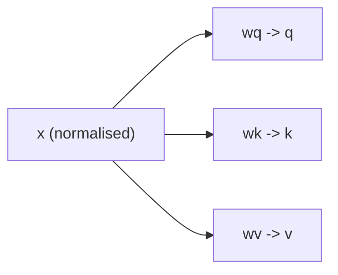
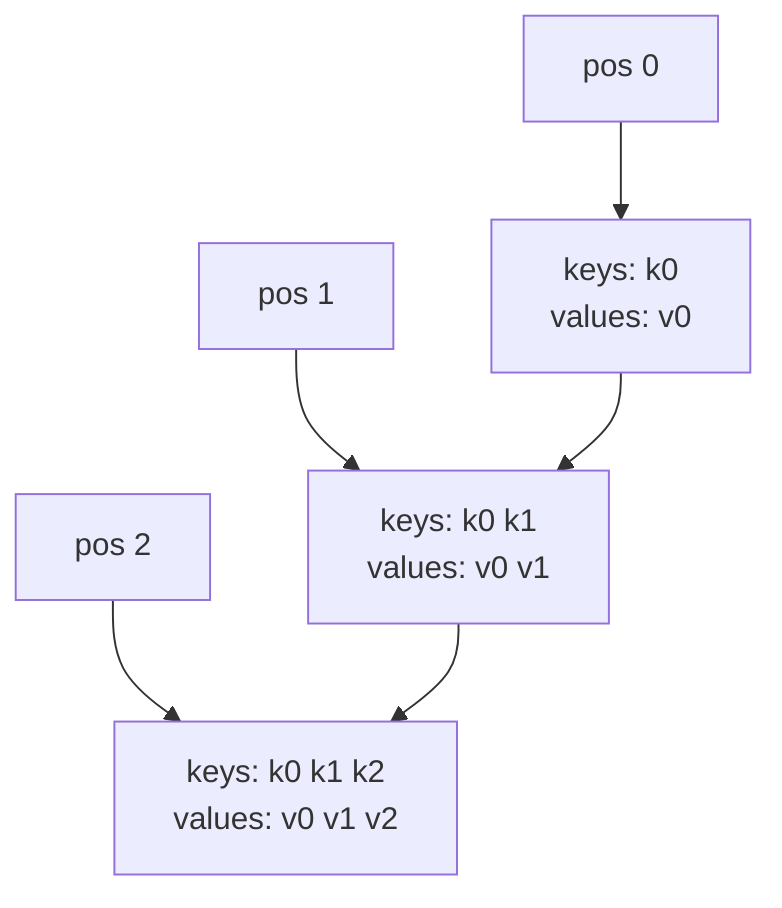
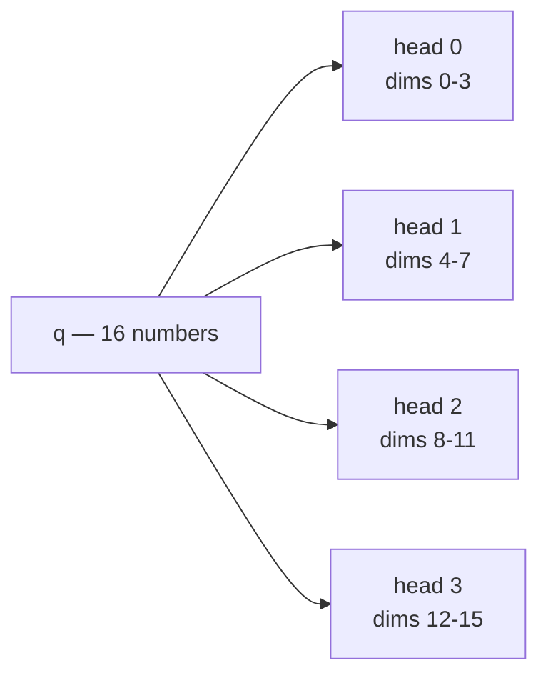
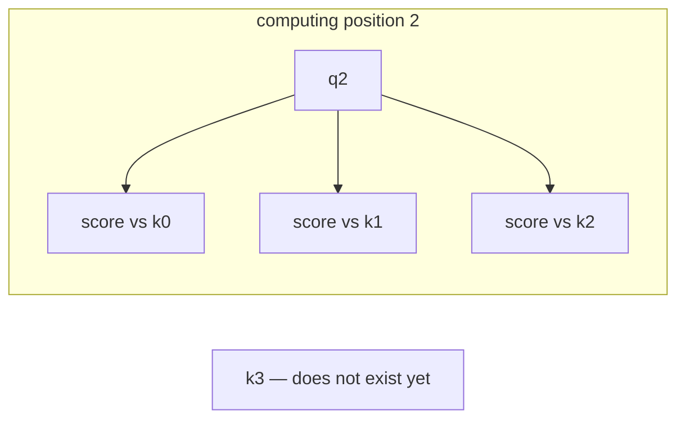

---
jupytext:
  text_representation:
    extension: .md
    format_name: myst
    format_version: 0.13
    jupytext_version: 1.19.5
kernelspec:
  display_name: LightningcatcherGPT
  language: python
  name: lcgpt
---

+++ {"editable": true, "slideshow": {"slide_type": ""}}

# 04 — Attention

Covers `karpathy.py` lines 121–125 and 141–161. Twenty-six lines, and the place
where most people's intuition about transformers gives out.

Everything in notebook 03 operates on one position at a time: the embedding, the
MLP and the output head never look at any token but the current one. Attention is
the only mechanism in the entire file that moves information between positions.

Code cells reproduce the source verbatim, dedented where a fragment sits inside a
function or a loop.

+++

## 4.1 `softmax` — lines 121–125

Turns a list of arbitrary real numbers into a probability distribution — all
positive, summing to one — while preserving their order:

$$
\mathrm{softmax}(z)_i = \frac{e^{\,z_i - \max_j z_j}}{\sum_k e^{\,z_k - \max_j z_j}}
$$

Subtracting the maximum changes nothing mathematically — the factor
$e^{-\max_j z_j}$ cancels top and bottom — but it keeps every exponent at or below
zero, so `math.exp` cannot overflow. Note that `max_val` is read off `.data` and
enters as a plain float, so it is treated as a constant and no gradient flows
through the choice of maximum.

> Used twice in the file: here for attention weights (line 157), and again to turn
> logits into token probabilities — §5.5 and §5.9 of notebook 05.

```{code-cell} ipython3
def softmax(logits):
    max_val = max(val.data for val in logits)
    exps = [(val - max_val).exp() for val in logits]
    total = sum(exps)
    return [e / total for e in exps]
```

## 4.2 Queries, keys and values — lines 141–147

The block opens the same way the MLP does: save the residual stream, normalise a
copy. Then three separate linear maps produce three different 16-dimensional views
of the same position:

$$
q = W_q\,x, \qquad k = W_k\,x, \qquad v = W_v\,x
$$

The names are the intuition. A **query** is what this position is looking for; a
**key** is what a position offers as a way of being found; a **value** is what gets
handed over when it is found. All three are learned, and nothing forces them to
mean anything — those roles emerge because of how they are used two cells below.



```{code-cell} ipython3
for li in range(n_layer):
    # 1) Multi-head Attention block
    x_residual = x
    x = rmsnorm(x)
    q = linear(x, state_dict[f'layer{li}.attn_wq'])
    k = linear(x, state_dict[f'layer{li}.attn_wk'])
    v = linear(x, state_dict[f'layer{li}.attn_wv'])
```

## 4.3 The KV cache — lines 148–149

`gpt` is called once per position, and never sees more than one token. The way it
reaches the past is that every call appends its own key and value to lists that
persist across calls.

At position $t$ the cache holds $t + 1$ entries: every position so far, including
this one. The query is only ever the current position's; the keys and values are
everyone's.

In this file the cache exists because the model is written one position at a time.
In a production system it exists as an optimisation — so that generating token
$t+1$ does not recompute keys and values for tokens $0 \ldots t$. Same data
structure, opposite motivation.



```{code-cell} ipython3
keys[li].append(k)
values[li].append(v)
```

## 4.4 Splitting into heads — lines 150–155

The 16 numbers are cut into 4 contiguous slices of 4, and each slice attends
independently. There is no separate per-head weight matrix: `wq`, `wk` and `wv` are
each a single 16×16, and the split is pure slicing on the output.

Heads let one position attend to several different things at once — a single
softmax has to commit its mass to one pattern, four of them do not. `x_attn` is the
list each head's output gets appended to, ready to be stitched back together in
§4.8.



```{code-cell} ipython3
x_attn = []
for h in range(n_head):
    hs = h * head_dim
    q_h = q[hs:hs+head_dim]
    k_h = [ki[hs:hs+head_dim] for ki in keys[li]]
    v_h = [vi[hs:hs+head_dim] for vi in values[li]]
```

## 4.5 Attention scores — line 156

For each position $t$ in the cache, one dot product between this position's query
and that position's key. A large score means the query and the key point in similar
directions — that is the entire matching mechanism.

$$
a_t = \frac{q \cdot k_t}{\sqrt{d_h}}
$$

The $\sqrt{d_h}$ divisor keeps the scores from growing with head width. A dot
product of $d_h$ terms has standard deviation proportional to $\sqrt{d_h}$, and if
the scores get large the softmax saturates — one weight near 1, the rest near 0,
and gradients near zero everywhere.

```{code-cell} ipython3
attn_logits = [sum(q_h[j] * k_h[t][j] for j in range(head_dim)) / head_dim**0.5 for t in range(len(k_h))]
```

## 4.6 Causal masking, by omission — line 156 again

Textbook treatments of attention spend a paragraph on the causal mask: a matrix of
$-\infty$ above the diagonal, ensuring position $t$ cannot see position $t+1$.

There is no mask in this file. Look at what `t` ranges over on line 156 —
`range(len(k_h))`, the length of the cache — and recall from §4.3 that the cache
only ever contains positions $0 \ldots t$, because positions are processed in order
and each appends its own key before reading. **The future has not been computed
yet, so it cannot be attended to.**

The mask and the cache are two implementations of one fact. A batched
implementation computes all positions at once and therefore needs the mask to put
back the constraint this loop gets for free.



```{code-cell} ipython3
attn_logits = [sum(q_h[j] * k_h[t][j] for j in range(head_dim)) / head_dim**0.5 for t in range(len(k_h))]
#                                                                                 ^^^^^^^^^^^^^^^^^^^^
#                                                              the cache holds only positions 0..t —
#                                                              this *is* the causal mask
```

## 4.7 Weights and the weighted sum — lines 157–159

The scores become a distribution over the positions seen so far, and the head's
output is those weights applied to the cached values:

$$
w = \mathrm{softmax}(a), \qquad
o_j = \sum_{t} w_t\, v_{t,j}
$$

This is the payoff. Each head returns a blend of what earlier positions offered,
mixed in proportion to how well this position's query matched their keys. Because
$\sum_t w_t = 1$, the output is an average — attention cannot amplify, only select
and combine.

```{code-cell} ipython3
attn_weights = softmax(attn_logits)
head_out = [sum(attn_weights[t] * v_h[t][j] for t in range(len(v_h))) for j in range(head_dim)]
x_attn.extend(head_out)
```

## 4.8 Output projection and residual — lines 160–161

The concatenated heads pass through one more learned matrix before rejoining the
residual stream. `wo` is what lets the heads' outputs be recombined rather than
merely stacked — without it, head $h$ could only ever write to dimensions
$4h \ldots 4h+3$.

> Line 161 also appears in §3.9 of notebook 03, alongside the MLP's residual add,
> where the pattern rather than the attention is the subject.

```{code-cell} ipython3
x = linear(x_attn, state_dict[f'layer{li}.attn_wo'])
x = [a + b for a, b in zip(x, x_residual)]
```
